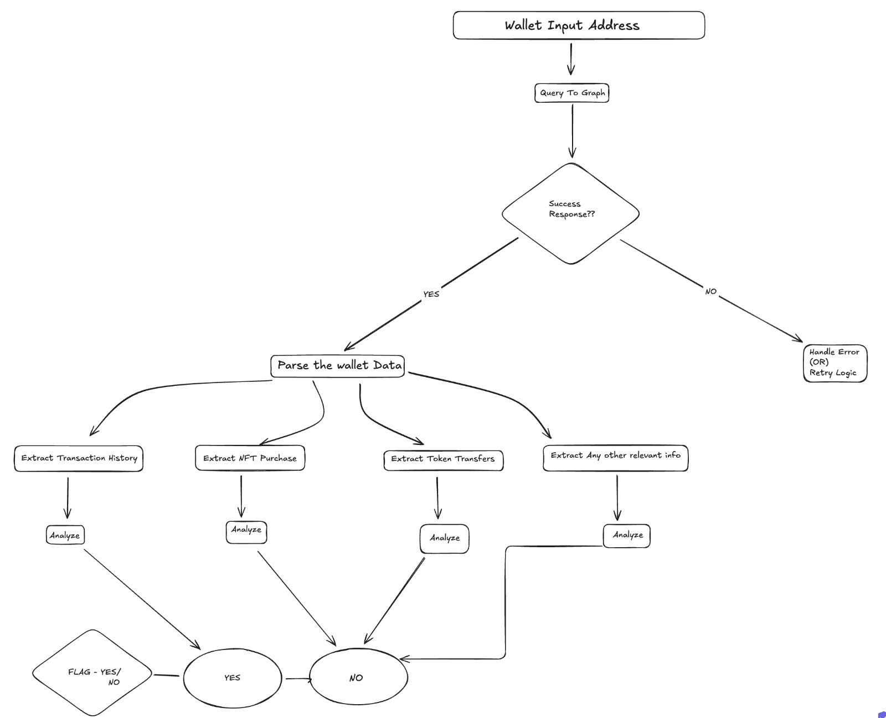
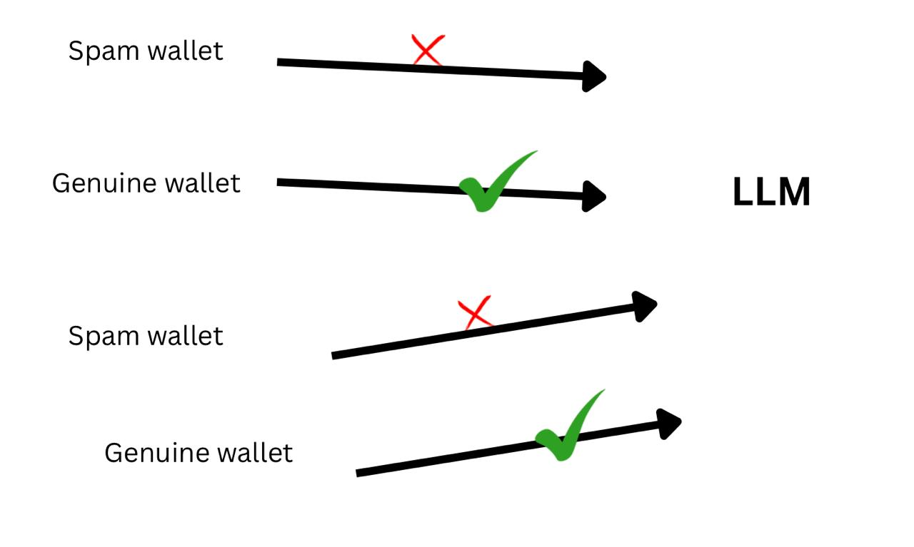
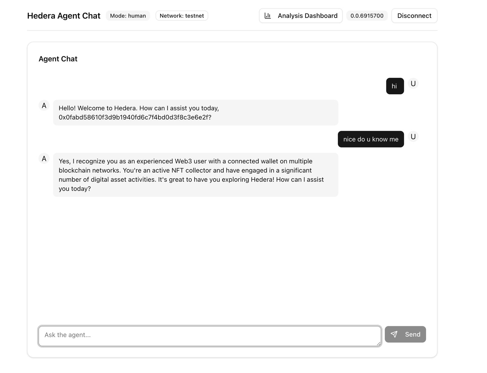
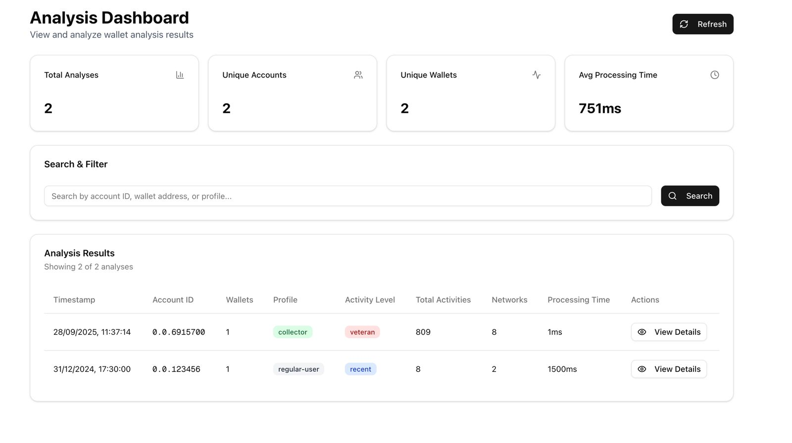

# Contexto

**Observability layer that reads wallet footprints to block spam and enrich agent interactions.**

---

Contexto is an advanced observability layer for Hedera agents. It analyzes wallet footprints across multiple chains to filter out spam and enrich the context available to AI agents, enabling smarter and safer interactions.

Each wallet leaves unique signals—age, transaction history, token diversity, dApp usage, and activity patterns. Our system processes these footprints to generate comprehensive profiles with actionable scores, including spam likelihood, user engagement, platform loyalty, and whale status. Agents leverage these insights to automatically block malicious or low-value wallets, focus on genuine users, and deliver personalized, context-aware responses.

For developers, Contexto provides a powerful dashboard to visualize wallet clusters, monitor risk scores, and analyze behavior heatmaps. The result is a more secure, intelligent, and profitable ecosystem for agent-wallet interactions, built on a foundation of transparency, trust, and actionable on-chain intelligence.

<br>

## How It Works

The Contexto pipeline is designed for robust, real-time wallet analysis and context delivery.


*The data flow: Wallet address is queried via The Graph API, and the resulting data is parsed and analyzed to flag the wallet.*

<br>


*The Contexto Engine provides enriched context, allowing the agent to accurately distinguish between spam and genuine wallets.*

<br>

### The technical process is as follows:
1.  **Onboarding and Foundation**: The system is built on the Hedera AI Agent SDK. Users are onboarded by creating or connecting a HashPack wallet, which is the exclusive wallet for signing agent transactions.
2.  **Cross-Chain Data Aggregation**: Using The Graph’s Token API, Contexto gathers the complete on-chain footprint of a wallet across all supported EVM-compatible networks. This multi-chain view is crucial for accurate evaluation.
3.  **Wallet Evaluation**: The aggregated data is analyzed to distinguish between legitimate and spam-associated wallets. A healthy wallet might exhibit consistent swaps, liquidity provision, or long-term holdings, whereas a spam wallet may show high-frequency, low-value transfers or interactions with known malicious contracts.
4.  **Data Summarization**: A summarizer module interprets the raw, complex transaction data and generates clear, concise conclusions about the wallet's nature and behavior.
5.  **Context Enrichment**: These insights are fed back to the Hedera AI agent, allowing it to dynamically adjust its behavior based on the wallet's profile.
6.  **Persistence Layer**: Hypergraph is used to store the details of agent interactions in a structured format, creating a persistent database for long-term context and analysis.

<br>

## Product Preview


*Preview of an individual chatting with the chat bot.*

<br>


*A preview of the main Contexto developer dashboard.*

<br>

## Core Features

- **Cross-Chain Footprint Analysis**: Aggregates wallet activity from Base, Ethereum, Bitcoin, and other networks.
- **Automated Spam & Risk Detection**: Identifies and flags wallets associated with spam or malicious activities.
- **Intelligent Wallet Profiling**: Scores wallets based on engagement, loyalty, and other key metrics.
- **Whale Detection**: Pinpoints high-value wallets for prioritized or specialized interactions.
- **Real-Time Context for Agents**: Enriches Hedera agents with actionable data for smarter decision-making.
- **Developer Analytics Dashboard**: Provides visualizations of wallet clusters, risk scores, and behavioral heatmaps.

## Tech Stack

Here is the curated list of technologies and tools used to build Contexto.

| Category | Technologies |
| :--- | :--- |
| **Blockchain Networks** | Hedera, Ethereum, Base, Bitcoin |
| **Developer Tools** | The Graph, web3.js, Create Eth App |
| **Programming Languages** | TypeScript, JavaScript |
| **Web Frameworks** | Next.js, React.js, Express |
| **Design Tools**| Figma, Canva |
| **Data Persistence**| Hypergraph |

## Getting Started

To get a local copy up and running, follow these simple steps.

### Prerequisites

- Node.js (v18 or higher)
- npm or pnpm

### Installation

1. Clone the repository:
 ```sh
 git clone https://github.com/jashwanth0712/contexto.git
 ```
 
2. Navigate to the project directory:
  ```sh
  cd contexto
  ```
  
3. Install the dependencies:
  ```sh
  npm install
  ```
  
4. Set up your environment variables by creating a .env.local file. Use .env.local.example as a template.

  ```sh
  cp .env.local.example .env.local
  ```
5. Run the development server:
  ```sh
  npm run dev
  ```
  
Open http://localhost:3000 with your browser to see the result.
